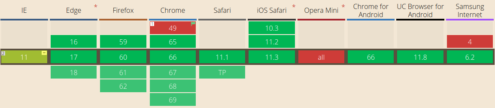
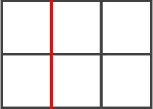
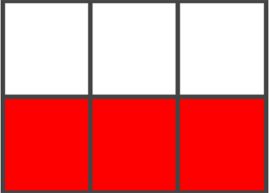
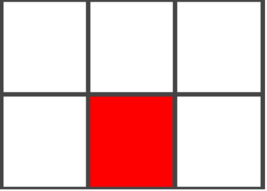
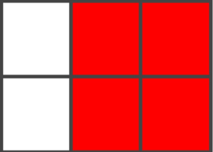
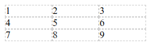
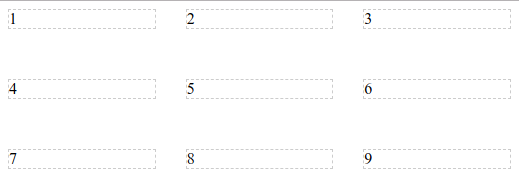

# CSS Grid Layout

## Introducción
CSS4 como tal no existe. A partir de CSS3 el estándar para hojas de estilo en cascada se divide en módulos, cada uno con su número de versión.

> Por ejemplo, **Flexbox está** en su versión 1 aunque por tecnología esté a camino entre CSS3 y lo que sería CSS4.

Dentro de estos **nuevos módulos CSS4** nos encontramos con **Grid Layout**, también en su primera versión. Es una nueva forma de maquetar y colocar la información en nuestras páginas webs.

## Soporte
**CSS Grid Layout** cuenta con soporte en casi todos los navegadores actuales.


[Imagen de la web caniuse](https://caniuse.com/ "caniuse")

## Conceptos básicos de CSS Grid Layout
El aprendizaje de CSS Grid Layout puede ser un poco complicado al principio (incluso más que flexbox) por la cantidad de sus propiedades y su potencia. Antes de empezar es necesario tener claro algunos términos.

* **Grid:** Por si hay algún iniciado en este mundo y no sepa aún qué es un grid. Un grid es un conjunto de líneas horizontales y verticales que crean filas y columnas.

* **Grid Container:** Se refiere al área que es declarada como un grid. Es decir, cuando declaras un elemento como “display:grid” o “display:inline-grid”.

* **Grid Lines:** Son las líneas horizontales y verticales que dividen el Grid. Éstas se encuentran a cada lado de una fila o columna.



* **Grid Tracks:** Es el espacio que hay entre dos Grid Lines, ya sean horizontales o verticales.



* **Grid Cell:** Es el espacio que se encuentra entre cuatro Grid Lines. La típica celda de una tabla.



* **Grid Area:** Se trata del espacio que hay entre cuatro Grid Lines que a su vez contiene varios Grid Cells.



### ¿Por dónde empiezo?
Mostraré unos ejemplos para entender mejor las propiedades básicas.

## Grid Elements
Un diseño de ***grid*** consiste en un elemento principal, con uno o más elementos secundarios.

El código HTML.
```html
<div class="grid-container">
  <div class="grid-item">1</div>
  <div class="grid-item">2</div>
  <div class="grid-item">3</div>
  <div class="grid-item">4</div>
  <div class="grid-item">5</div>
  <div class="grid-item">6</div>
  <div class="grid-item">7</div>
</div>
```
> El elemento principal sería .grid-container, mientras los elementos hijos serían .grid-item

El código CSS3.
```css
.grid-container {
  /*Definimos al padre como grid*/
  display: grid;
  /*Definimos explicitamente cuantas columnas tendrá el grid*/
  grid-template-columns: auto auto auto; /* 3 columnas de tamañan automático */
}
```
> Cuando inspeccionemos el padre .grid-container veremos algo como esto



## Grid Columns
Las líneas verticales de elementos de la grilla se llama columnas.

## Grid Rows
La línea horizontal de elementos de la grilla se llama filas.

## Grid Gaps
El espacio entre cada *columna / fila* se llama espacios.

El código CSS3.
```css
.grid-container {
  /*Espaciado entre celdas en filas y columnas*/
  grid-row-gap: 50px;
  grid-column-gap: 30px;
}
```



> Grid Gaps tiene su forma reducida

El código CSS3.
```css
.grid-container {
  /*grid-gap: filas columnas;*/
  grid-gap: 50px 30px;
}
```

## Aquí les dejo un ejemplo utilizando la poderosa propiedad que nos trae CSS Grid Layout

El código HTML.
```html
<div class="post-content">
  <a href="#" class="post-item">
    <figure>
      
    </figure>
    <span class="puntaje">
      <p>
        <span class="post-likes">M 818</span>
        <span class="post-comments">C 18</span>
      </p>
    </span>
  </a>
  <a href="#" class="post-item">
    <figure>
      
    </figure>
    <span class="puntaje">
      <p>
        <span class="post-likes">M 818</span>
        <span class="post-comments">C 18</span>
      </p>
    </span>
  </a>
  <a href="#" class="post-item">
    <figure>
      
    </figure>
    <span class="puntaje">
      <p>
        <span class="post-likes">M 818</span>
        <span class="post-comments">C 18</span>
      </p>
    </span>
  </a>
  <a href="#" class="post-item">
    <figure>
      
    </figure>
    <span class="puntaje">
      <p>
        <span class="post-likes">M 818</span>
        <span class="post-comments">C 18</span>
      </p>
    </span>
  </a>
  <a href="#" class="post-item">
    <figure>
      
    </figure>
    <span class="puntaje">
      <p>
        <span class="post-likes">M 818</span>
        <span class="post-comments">C 18</span>
      </p>
    </span>
  </a>
  <a href="#" class="post-item">
    <figure>
      
    </figure>
    <span class="puntaje">
      <p>
        <span class="post-likes">M 818</span>
        <span class="post-comments">C 18</span>
      </p>
    </span>
  </a>
  <a href="#" class="post-item">
    <figure>
      
    </figure>
    <span class="puntaje">
      <p>
        <span class="post-likes">M 818</span>
        <span class="post-comments">C 18</span>
      </p>
    </span>
  </a>
  <a href="#" class="post-item">
    <figure>
      
    </figure>
    <span class="puntaje">
      <p>
        <span class="post-likes">M 818</span>
        <span class="post-comments">C 18</span>
      </p>
    </span>
  </a>
  <a href="#" class="post-item">
    <figure>
      
    </figure>
    <span class="puntaje">
      <p>
        <span class="post-likes">M 818</span>
        <span class="post-comments">C 18</span>
      </p>
    </span>
  </a>
  <a href="#" class="post-item">
    <figure>
      
    </figure>
    <span class="puntaje">
      <p>
        <span class="post-likes">M 818</span>
        <span class="post-comments">C 18</span>
      </p>
    </span>
  </a>
  <a href="#" class="post-item">
    <figure>
      
    </figure>
    <span class="puntaje">
      <p>
        <span class="post-likes">M 818</span>
        <span class="post-comments">C 18</span>
      </p>
    </span>
  </a>
  <a href="#" class="post-item">
    <figure>
      
    </figure>
    <span class="puntaje">
      <p>
        <span class="post-likes">M 818</span>
        <span class="post-comments">C 18</span>
      </p>
    </span>
  </a>
  <a href="#" class="post-item">
    <figure>
      
    </figure>
    <span class="puntaje">
      <p>
        <span class="post-likes">M 818</span>
        <span class="post-comments">C 18</span>
      </p>
    </span>
  </a>
  <a href="#" class="post-item">
    <figure>
      
    </figure>
    <span class="puntaje">
      <p>
        <span class="post-likes">M 818</span>
        <span class="post-comments">C 18</span>
      </p>
    </span>
  </a>
  <a href="#" class="post-item">
    <figure>
      
    </figure>
    <span class="puntaje">
      <p>
        <span class="post-likes">M 818</span>
        <span class="post-comments">C 18</span>
      </p>
    </span>
  </a>
  <a href="#" class="post-item">
    <figure>
      
    </figure>
    <span class="puntaje">
      <p>
        <span class="post-likes">M 818</span>
        <span class="post-comments">C 18</span>
      </p>
    </span>
  </a>
</div>
```

El código CSS3.
```css
* {
  font-family: Arial;
}
body {
  margin: 0;
}
.post-content {
  background: #fafafa;
  /*Primero definimos al padre como grid*/
  display: grid;
  /*Definimos explícitamente cuantas columnas tendrá el grid*/
  grid-template-columns: repeat(3, minmax(80px, 293px));
  /*Alineando content, los valores que acepta son:
    justify-content | align-content: start end center stretch space-around space-between space-evenly;
  */
  justify-content: center;
  /*Espaciado entre celdas en filas y columnas*/
  grid-gap: 28px;
}
.post-item {
  display: inline-block;
  position: relative;
  text-decoration: none;
}
.post-item:hover .puntaje {
  display: flex;
}
.post-item figure{
  margin: 0;
}
.post-item figure img{
  width: 100%;
  vertical-align: top;
}
.post-item .puntaje {
  position: absolute;
  background: #00000044;
  bottom: 0;
  left: 0;
  right: 0;
  top: 0;
  display: none;
  justify-content: center;
  align-items: center;
  color: white;
}

.post-likes,
.post-comments {
  font-size: 18px;
  width: 80px;
  margin: 5px;
  font-weight: bold;
  text-align: center;
  display: inline-block;
}

@media (max-width: 720px) {
  .post-content {
    grid-gap: 3px;
  }
}
```
